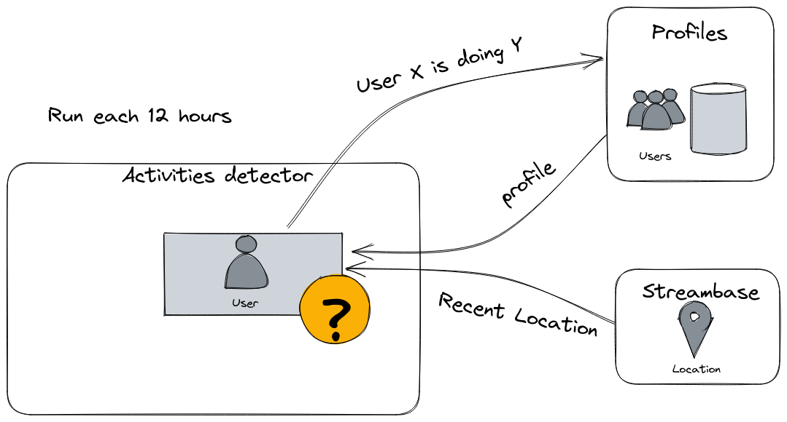

# activities-predictor

Detect activities for the wenet users



This command-line interface (CLI) predicts Wenet activities for users. You can set various parameters like the maximum number of users to process, enable looping, specify the number of hours between loops, and choose the environment to use.

## Usage

To use the Wenet activities predictor CLI, run the following command with the desired options:

```bash
python main.py [--nbmax NBMAX] [--do_loop] [--delta_hours DELTA_HOURS] [--env ENV]
```

### Options

    --nbmax NBMAX (optional): Set the maximum number of users to process. If not provided, all users will be processed.
    --do_loop (optional): Enable looping. If enabled, the script will loop forever.
    --delta_hours DELTA_HOURS (optional): Set the number of hours before each loop (if loop is enabled). Default is 12 hours.
    --env ENV (optional): Choose the environment to use. Options are "dev", "beta", or "prod". Default is "dev".

### Examples

Process all users without looping:

```bash
python main.py --env prod
```

Process the last 10 users with looping enabled and a 6-hour loop interval:

```bash
python main.py --nbmax 10 --do_loop --delta_hours 6 --env prod
```
